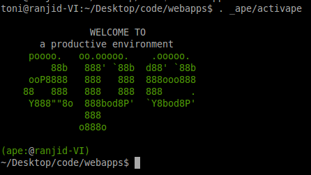

Installing django-productline
===============================

To install django-productline, you must choose an installation
directory. So, for example choose ``~/Desktop/code/webapps``.
*webapps* will be the installation directory. But you don't need
to create it, as the install script will do it for you.
So *cd* in your ``~/Desktop/code`` and execute the following script:

.. code::

    wget -O - https://raw.github.com/henzk/django-productline/master/bin/install.py | python - webapps

In fact we just download and execute the ``install.py`` script. ``- webapps``
specifies the *master container* where your django-productline applications
will live in.
Congratulations! You just installed django-productline.
If you got errors, please make sure you have *virtualenv* installed.

So, as first step ``cd`` into your webapps directory::

    webapps
    |--_ape
  
The ``webapps`` directory is the master container for all your django-produtline projects. 
It brings a *virtualenv* for nall your applications.
Beyond that, *ape* provides a wide range of maintenance functionality for your projects.

So as next step, we need to activate *ape* to activate the virtualenv:

.. code::

    . _ape/activape
    
    
Everything you now install is installed into ape's *virtualenv*.

We've almost made it. As last step we need to install
some additional packages::

    pip install -r _ape/venv/src/django-productline/requirements-dev.txt
    
django-productline has now successfully installed on your machine.

