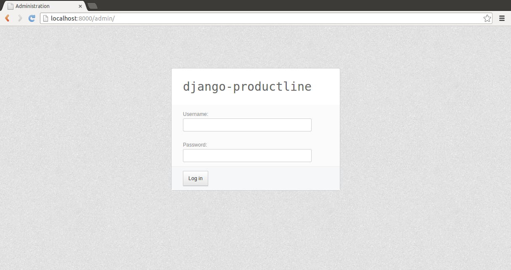

Example project
###################

Downloading the example project
=========================================

The easiest way to get started with django-productline is to get
the example project from github. So we ``cd`` into your ``webapps`` master container
and clone the example project from github::

    cd ~/Desktop/code/webapps
    git clone https://github.com/tonimichel/djpl-example-project
    

After we've done this we should see the following folder structure::

    webapps
    |--_ape
    |--djpl-example-project
       |--features
       |--products

At this point, we need to declare some terminology:

* The ``webapps`` folder is the so called *master container*. It is the environment where your *djpl* stuff will live in.
* The ``_ape`` folder encapsulates *ape* which provides the virtualenv and a set of productivity tools to maintain djpl applications.
* All folders directly under ``webapps`` (except ``_ape``) are projects. These project folders are called *containers*. A container encapsulates all your project stuff.

So, in summary, we speak of *projects* in means of *containers*. All our projects will live in a *master container* (providing a virtualenv and *ape*). 
A project consists of features and products. A product is a web application running on a certain domain:port. A product provides
a selection of features. A feature is the equivalent to a django app (read this section for more information about features:LINK).
Project-specific features are defined in the project's ``features`` directory. 
Often we want to use features across multiple projects. This can be accomplished by creating so called *feature pools*.
However, at this point we'll concentrate on the example project. 

..
    Now, let's have a look at the example project in more detail::

        |--djpl-example-project
           |--features
              |--news
              |--adressbook
           |--products
              |--product1
              |--product2

    As described in the previous section, the ``features`` folder contains all your project-specific
    features. Our example project provides a *news* feature and an *adressbook* feature and
    two products.

Finally we need to install some basic features:

    pip install -r requirements.txt

Configuration, syncdb, runserver
=================================

So let's get it running!

The first thing we have to do - and we always have to do it when working with django-productline projects - is
to activate *ape*::

    cd ~/Desktop/code/webapps
    . _ape/activape
    

.. image:: ../img/ape.png
    :align: center
    :width: 40%
    :alt: fig1

(Once "activaped", the *virtualenv* is activated and the *ape management tasks* are available
on our shell.)

Each product has a (slightly) different configuration depending on the machine it is deployed.
Consider for example the django the ``SECRET_KEY`` which "is used to provide cryptographic signing, and should be set to a unique, unpredictable value".
These deployments specific configurations are stored in a ``context.json`` file which must be provided by each product.

.. warning::

    It is strongly recommended to not put your ``context.json`` under version control. Instead generate it once
    for each deployment of your project.

To generate the ``context.json`` enter the following in your shell::

    ape generate_context_json djpl-example-project:product1
    
This command generates the ``context.json`` for the product *product1* of the *djpl-example-project* container.
So everytime we need to setup or deploy a new product we initially need to generate the context
with this command. The following listing shows the generated ``context.json`` for *product1* ::

    {
        "SECRET_KEY": "8mhc=bv0046wp#9#k7un$=_)s=bq5(l+dvdn3)y6&=nz&be(44", 
        "SITE_ID": 1
    }
    
Last but not least we need to run ``syndb` and finally ``runserver``. Before that, we need
to switch to the product we want to start::

    ape zap djpl-example-project:product1

This command teleports ape into the right context, setting all environment variables according to
the selected product. Finally we can synchronize the database and run the server::

    ape manage syncdb
    ape manage runserver
    
Enter ``http://localhost:8000/admin/`` into your browser's address bar and there you go:

    
    

